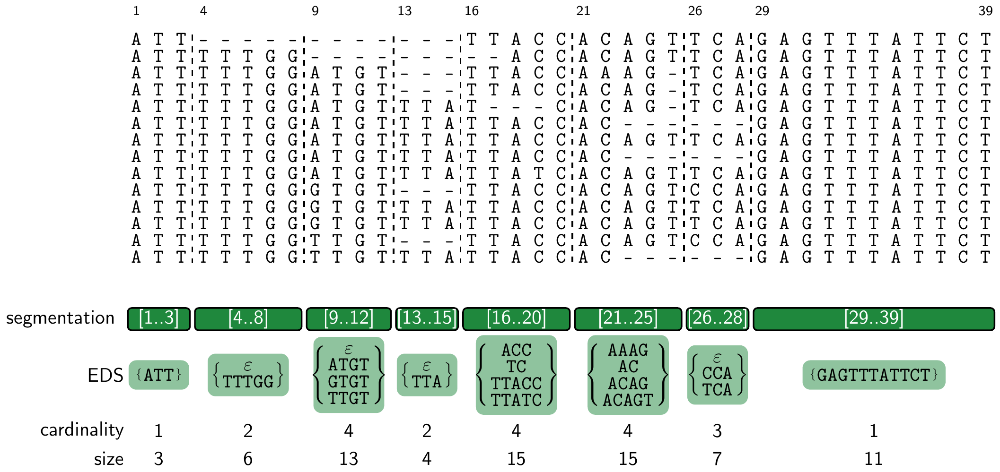

# eds

Program `mincard` constructs an Elastic Degenerate String of minimum total cardinality, from a Multiple Sequence Alignment in FASTA format (tested with GCC on Linux). You can get this repository, download the [SDSL v3](https://github.com/xxsds/sdsl-lite) dependency, and compile the [HTSlib](https://github.com/samtools/htslib) dependency with
```sh
git clone https://github.com/algbio/eds && cd eds
git submodule update --init --recursive ext/sdsl-lite
(git submodule update --init --recursive ext/htslib && cd ext/htslib && autoreconf -i && ./configure && make) # if HTSlib + headers are not installed in your system, see https://github.com/samtools/htslib/blob/develop/INSTALL
make
./mincard test/msa.fa -o test/msa.eds
```
By default, `mincard` sets a maximum segment length of 31, processes the MSA efficiently with the positional Burrows–Wheeler transform, treats the gaps as normal alphabet symbols when optimizing the cardinality, and considers MSA segments with no variation (perfect segments) even when longer than the allowed segment length. The most influential parameter on the cardinality and size of the output EDS is the upper bound on the segment length `-U`. See`./mincard -h` for the complete list of options.

## todo
- QC on the EDSes in experiment (maybe with https://github.com/giovannarosone/EDS-BWT?)
- show VCF workflow in README
- document, provide scripts, or complete the `--column-major` option (maybe use an existing pBWT format?)
